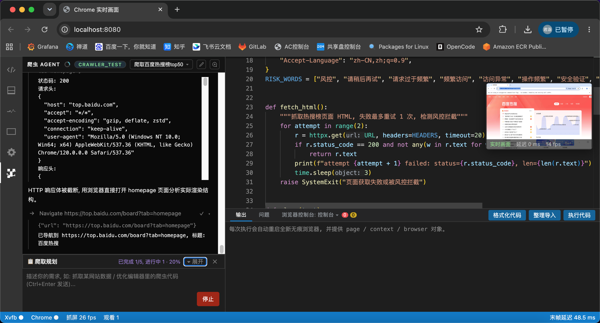

<div align="center">

# 🖥️ AgentCrawlerStudio

**Xvfb 虚拟显示器 + 有头 Chrome 真实窗口 + Pillow 抓屏，通过 WebSocket 推流的浏览器远程控制台**

无 ffmpeg 依赖 · 亚 20ms 端到端延迟 · 内置 Playwright / Pyright LSP / 爬虫 Agent


</div>

---

一个把 **真实浏览器窗口**（含标签栏 / 地址栏）以**毫秒级延迟**实时推送到网页的控制台项目：

- Xvfb 虚拟显示器上运行**有头 Chrome**，Pillow 直接抓取屏幕并 JPEG 编码，经 WebSocket 推流——**全程不依赖 ffmpeg**。
- 内置 **Playwright 代码编辑器**（Monaco + Pyright LSP），可直接写脚本控制浏览器，实时看到画面与效果。
- 内置 **DevTools 风格面板**（Console / Elements / Network / Application）。
- 内置 **爬虫 Agent**（LangChain + DeepAgents），会话式多轮对话，自动编写并交付爬虫脚本。

## 📑 目录

- [✨ 特性](#-特性)
- [🖼️ 界面预览](#️-界面预览)
- [🏗️ 架构](#️-架构)
- [⚡ 毫秒级延迟](#-毫秒级延迟)
- [🚀 快速开始](#-快速开始)
  - [环境要求](#环境要求)
  - [安装与启动](#安装与启动)
  - [前端开发模式](#前端开发模式)
  - [界面功能一览](#界面功能一览)
- [⚙️ 配置参数](#️-配置参数)
- [🔌 HTTP/WS 接口](#-httpws-接口)
- [📖 使用指南](#-使用指南)
  - [Playwright 代码控制](#playwright-代码控制)
  - [爬虫编码器内置函数](#爬虫编码器内置函数)
  - [登录凭据复用](#登录凭据复用)
  - [爬虫 Agent](#爬虫-agent)
- [🧪 测试](#-测试)
- [❓ 常见问题](#-常见问题)
- [🤝 参与贡献](#-参与贡献)
- [📄 License](#-license)

## ✨ 特性

| 能力 | 说明 |
|------|------|
| **毫秒级实时画面** | 30fps 连续抓屏 + WebSocket 推送最新帧，静态页末帧延迟稳定在 ~20ms |
| **无 ffmpeg 依赖** | Pillow `ImageGrab` 直读 X11 屏幕，JPEG 编码单帧 ~25ms，全异步不阻塞 |
| **真实浏览器窗口** | 有头 Chrome（含地址栏 / 标签栏）渲染在画面上，每次执行代码自动重启全新浏览器 |
| **Playwright 控制台** | Monaco 编辑器 + `Ctrl+Enter` 执行，预置 `page` / `context` / `browser` |
| **Pyright LSP** | 内联类型推断 / 补全 / 悬停 / 定义跳转 / 诊断，等价 Pylance 精度 |
| **DevTools 面板** | Console / Elements / Network / Application 四个面板贴近 Chrome DevTools |
| **代码辅助** | black 格式化、isort 整理导入、auto-import 快速修复、inlay hints |
| **爬虫 Agent** | 会话式多轮对话，自动规划 → 调试 → 写回脚本，支持交互式登录 |
| **登录凭据复用** | ticket 按 host + crawler_id 存 MongoDB，登录一次自动复用 |

## 🖼️ 界面预览

> 页面为 VSCode 风格布局：左侧活动栏 → Monaco 代码编辑器 → 底部输出栏（问题 / 输出 / DevTools）/ 状态栏（Xvfb / Chrome / 帧率 / 观看数 / 末帧延迟），右上角悬浮真实 Chrome 实时画面。



## 🏗️ 架构

```
+-----------+    X11    +----------------+               +-----------+
|   Xvfb    |<----------| Chrome(有头)    |  <---CDP----  | Playwright|
| :99 虚拟屏 |           | 真实窗口含顶栏  |  (ws 9222)     | (控制)    |
+-----+-----+           +----------------+               +-----------+
      ^ Pillow ImageGrab (XGetImage 直读)
      |
      v JPEG 编码 (Pillow, ~25ms/帧)
+--------------------+
| FastAPI WebSocket  |--- /ws/live ---> 浏览器实时画面
| 扇出(仅最新帧)      |   二进制: 时间戳+JPEG
+--------------------+
```

- **Xvfb**：虚拟显示器 `:99`（1280x800x24），供有头 Chrome 渲染。
- **Chrome**：有头模式运行，**真实浏览器窗口（含标签栏 / 地址栏）**显示在画面上；每次启动使用全新临时配置目录（非无痕模式——无痕下 CDP 的 Cookie API 会失效，改用全新 `--user-data-dir` 实现隔离），不残留历史记录 / Cookie；`--remote-debugging-port` 暴露 CDP 供 Playwright 控制。
- **抓屏**：Pillow `ImageGrab` 直接读虚拟屏 → JPEG 编码，**不经过 ffmpeg**；抓屏跑在后端 asyncio 后台任务中，单帧抓取 / 编码放入默认执行器（`asyncio.to_thread`），事件循环始终空闲。
- **FastAPI**：全异步（async/await）实现，**无线程**——所有接口与 WebSocket 均不阻塞事件循环；独立 asyncio 抓屏任务按 30fps 连续抓屏编码，WebSocket 只推送最新帧。
- **全异步依赖**：浏览器控制走 **Playwright async API**，网络请求走 `httpx` async client，MongoDB 走 **motor** 异步驱动，LSP 桥接走 `asyncio.create_subprocess_exec` + 异步 stdio。
- **爬虫与后处理**：后端内置 `httpx`、`BeautifulSoup` / `lxml`，代码编辑器可直接在脚本中 `import` 使用；基于 **pyright** 的类型分析以 `.venv/bin/python` 为解释器，基于 venv 中实际安装的包提供补全 / 签名提示 / 悬停文档（同时保留 `frontend/src/libApi.json` 作为变量语义高亮的类库索引）。除第三方库外，还覆盖 `os` / `os.path` / `sys` / `re` / `json` / `time` / `datetime` / `math` / `random` / `pathlib` / `html` / `hashlib` / `base64` / `csv` / `collections` / `itertools` / `functools` / `subprocess` / `glob` / `shutil` / `string` / `urllib.parse` / `urllib.request` 等常用标准库。

### ⚡ 毫秒级延迟

- 连续抓屏（30fps）保证画面恒新，**静态页面"末帧延迟"也稳定在 ~20ms**，不会越滚越大。
- WebSocket 推送最新帧、慢客户端自动丢旧帧，无缓冲积压。
- 实测（1280x800）：约 **30fps，端到端延迟 p50 ≈ 16ms，p90 ≈ 21ms**。

## 🚀 快速开始

### 环境要求

| 依赖 | 说明 |
|------|------|
| `uv` | Python 包管理器 |
| `Xvfb`、`chromium` / `google-chrome` | 系统工具 |
| 中文字体 | 网页中文显示为方框时需安装 |

```bash
# Debian/Ubuntu
apt install xvfb chromium fonts-noto-cjk
# Fedora/Rocky
dnf install xvfb chromium google-noto-sans-cjk-ttc-fonts
```

### 安装与启动

```bash
# 1. 安装后端依赖 (Python 3.12+)
uv sync

# 2. 构建前端 (首次或改前端后执行; 同时重新生成代码补全索引)
./build.sh

# 3. 启动 (后台运行, 日志 .app.log)
./run.sh
# 或前台运行:
uv run python -m backend.main

# 停止
./stop.sh
```

启动后访问：**http://\<主机IP\>:8080**

> 所有 API/WS 接口均挂在可配置前缀下，默认 **`/api/v1`**（如 `/api/v1/status`、`/api/v1/ws/live`），仅网页控制台 `GET /` 例外。可通过 `--api-prefix` 或环境变量 `API_PREFIX` 修改。

### 前端开发模式

前端为 React + Vite，代码编辑器基于 monaco-editor/react + monaco-languageclient，通过 WebSocket 桥接后端启动的 **pyright 语言服务器**，构建产物输出到 `static/`。

```bash
cd frontend && npm run dev    # 热更新, 自动代理后端 8080, 打开 http://127.0.0.1:5173
```

后端代码位于 `backend/`，按层拆分：

```
backend/
├── main.py          # 入口: FastAPI 应用工厂 + 生命周期
├── config.py        # 配置层: Config / 命令行参数 / 工具函数
├── schemas.py       # Schema 层: 接口输入输出约束(Pydantic 模型)
├── services/        # 服务层: 抓屏、Xvfb/Chrome 链路、Playwright 控制、LSP 桥接
│   ├── capture.py   #   Subscriber / ScreenCapture 抓屏 asyncio 任务
│   ├── browser.py   #   BrowserStream 子进程与浏览器控制(异步 Playwright)
│   ├── cdp.py       #   CDPManager: 通用 CDP 会话/频道/事件分发
│   ├── console.py   #   ConsoleChannel: DevTools Console 同步
│   ├── network.py   #   NetworkChannel: 网络请求记录与响应体
│   ├── dom.py       #   DOMChannel: DOM 树与元素盒模型(高亮)
│   ├── storage.py   #   StorageChannel: Local/Session Storage/Cookies/IndexedDB
│   ├── lsp.py       #   LspManager / LspSession: 浏览器 WebSocket <-> pyright 子进程桥接
│   ├── crawler.py   #   代码执行环境注入的爬虫默认函数(save_page/save_content/登录凭据等)
│   ├── sandbox.py   #   受限沙箱 safe_builtins: 禁 open/os/pathlib/shutil/subprocess 等
│   ├── save.py      #   save_content 多格式序列化(txt/json/jsonl/csv/img)与字节截断
│   └── agent/       #   爬虫 Agent: core(LLM/虚拟文件系统) session prompts tools bridge runner
└── routers/         # 路由层: HTTP/WS 接口定义
    ├── console.py   #   GET /
    ├── control.py   #   /status /pages /navigate /screenshot /run /restart /console/* /network/* /dom/* /storage/* /format /organize-imports
    ├── lsp.py       #   /ws/lsp WebSocket + /lsp/info
    ├── stream.py    #   /ws/live + /ws/console + /ws/network + /ws/dom + /ws/storage + /live.mjpg
    └── agent.py     #   Agent 会话管理 / 多轮对话 / 问卷 / 登录 / /ws/agent / /editor/code
```

### 界面功能一览

- 页面主体为 **VSCode 风格布局**：最左侧活动栏（Activity Bar）、**占据整个页面的代码编辑器**、**底部输出栏**、底部状态栏（Xvfb / Chrome / 帧率 / 观看数 / 末帧延迟）。
- **Playwright 代码编辑器**（monaco-editor）：**占据整个页面**，每次执行自动重启全新浏览器（全新临时配置目录），支持 `Ctrl+Enter` 运行。
- **代码检查与编码辅助（LSP）**：编辑器内联 **pyright**（以 `.venv/bin/python` 为分析核心，等价 Pylance 的推理精度）——后端 `/api/v1/ws/lsp` 桥接 pyright 子进程，提供准确的类型推断、`对象.` 补全 / 悬停 / 签名提示、定义 / 引用跳转与静态检查；`page` / `context` / `browser` 三个注入全局由后端桩模块解析，不会误报未定义。
- **Pylance 风格编码辅助**：内置 **inlay hints（参数名提示）**，调用已知 API 时在位置实参前显示参数名，关键字实参自动跳过；语义高亮区分 **变量 / 参数** 两种 token。
- **代码快速修复（auto-import）**：当诊断报"未定义 `X`"且 `X` 命中类库索引时，编辑器小灯泡（💡）提供 "添加 import" 快速修复。
- **整理导入**：`Shift+Alt+O` 或底部输出栏的 **"整理导入"** 按钮，调用后端 isort 排序 / 分组导入语句。
- **问题栏（VSCode 风格）**：底部输出栏的 **"问题"** 标签页展示 pyright 检查结果（错误 / 警告计数、点击跳转），编辑器内同时有对应波浪线标注。
- **Python 代码美化**：`Shift+Alt+F` 或 **"格式化代码"** 按钮，调用后端 **black** 一键美化。
- **执行代码按钮与执行结果**放置在底部**输出栏**；输出栏**固定高度，可拖动其顶部边缘调整高度**。
- **活动栏图标弹出侧边面板**：点击浏览器控制 / 状态 / 打开页面 / 工具图标，在编辑器左侧弹出对应面板，再次点击或点 × 关闭。
- **悬浮实时画面**：显示**真实 Chrome 窗口**（含顶栏），毫秒级延迟；画面**始终悬浮**，默认缩在**右上角**（高度 ≤ 页面高度的 1/4），**点击放大**后居中悬浮，再次点击或点击暗色遮罩**缩小还原**。
- **浏览器控制台**：底部输出栏内置 **DevTools 面板**（点击"浏览器控制台"标签弹出子菜单）：
  - 子菜单含 **控制台 / Elements / Network / Application** 四项；
  - **Elements**：实时 DOM 树（自动跟随页面导航刷新），点击节点在**实时画面**上叠加高亮框，右侧显示元素属性；
  - **Console**：JS 求值（`Enter` 执行、`↑/↓` 翻历史）、对象逐层展开、`console.table` 表格、`%s/%d/%o/%c` 格式符、`console.group/count/time/assert/clear`、未捕获异常堆栈、级别 / 文本筛选、时间戳、错误 / 警告计数；
  - **Network**：请求表（名称 / 方法 / 状态 / 类型 / 大小 / 耗时 / 时间线），点击查看请求 / 响应头、请求负载、**响应正文**，类型与文本筛选、"保留日志"、清空；
  - **Application**：Local / Session Storage（双击单元格编辑、增删）、Cookies（增删改）、IndexedDB（数据库 → 对象仓库 → 数据浏览），存储变更实时刷新；
  - 每次执行代码会重启全新浏览器，各面板自动跟随新实例。
- 无活跃浏览器进程时，悬浮画面显示**默认 logo**；浏览器默认打开空白页（`about:blank`），无需传入 URL 参数。

## ⚙️ 配置参数

| 参数 | 环境变量 | 默认值 | 说明 |
|------|----------|--------|------|
| `--display` | `XFB_DISPLAY` | `:99` | Xvfb 显示器编号 |
| `--width` / `--height` | `XFB_WIDTH` / `XFB_HEIGHT` | `1280` / `800` | 虚拟屏幕/窗口尺寸 |
| `--framerate` | `FPS` | `30` | 抓屏帧率上限(受编码耗时约束) |
| `--quality` | `JPEG_QUALITY` | `70` | JPEG 画质 1-100, 越高越清晰但带宽越大 |
| `--cdp-port` | `CDP_PORT` | `9222` | Chrome CDP 端口(占用时自动+1) |
| `--host` / `--port` | `WEB_HOST` / `WEB_PORT` | `0.0.0.0` / `8080` | Web 服务监听 |
| `--api-prefix` | `API_PREFIX` | `/api/v1` | 后端 API/WS 接口统一前缀 |
| `--chrome` | `CHROME_PATH` | 自动探测 | Chrome/Chromium 可执行文件路径 |
| `--crawler-id` | `CRAWLER_ID` | 空（Agent 回退 `"default"`） | 当前爬虫 ID, Agent 会话/`get/set_login_ticket` 据此隔离并关联 MongoDB 中的登录凭据 |
| `--mongo-uri` | `MONGO_URI` | `mongodb://127.0.0.1:27017` | MongoDB 连接地址 |
| `--mongo-db` | `MONGO_DB` | `crawler` | MongoDB 数据库名 |
| `--llm-provider` | `LLM_PROVIDER` | `deepseek` | LLM 服务商: deepseek / dashscope / openai / 其他 OpenAI 兼容接口 |
| `--llm-model` | `LLM_MODEL` | `deepseek-v4-flash` | LLM 模型名, 如 deepseek-v4-flash / qwen-plus / gpt-4o |
| `--llm-api-key` | `LLM_API_KEY` | 空 | LLM API Key (爬虫 Agent 必需) |
| `--llm-base-url` | `LLM_BASE_URL` | 空 | LLM 兼容接口 base URL, 留空按 provider 自动推断 |
| `--llm-temperature` | `LLM_TEMPERATURE` | `0.2` | LLM 采样温度 |
| `--dev-limit` / `--no-dev-limit` | `DEV_LIMIT` | `1`（开启） | 开发测试模式限制爬取数据量；同步上线时用 `--no-dev-limit`（或 `DEV_LIMIT=0`）取消 |
| `--max-items` | `MAX_ITEMS` | `50` | 开发模式下 `save_content` / `limit_items` 对列表/迭代的最大条数 |
| `--max-bytes` | `MAX_BYTES` | `524288`（512KB） | 开发模式单次保存（`save_content` 文本 / `save_page` HTML）的最大字节数 |

**带宽参考**（1280x800）：`--quality 70` 约 3~5 Mbps。带宽紧张可降低 `--quality` 或分辨率。

## 🔌 HTTP/WS 接口

| 方法 | 路径 | 说明 |
|------|------|------|
| GET | `/` | 网页控制台 |
| WS  | `/api/v1/ws/live` | 实时画面 WebSocket（二进制: float64 时间戳 + JPEG） |
| GET | `/api/v1/live.mjpg` | MJPEG 兼容接口(兼容旧 `` 播放) |
| WS  | `/api/v1/ws/console` | 浏览器控制台实时同步 WebSocket（通过 CDP 监听 `consoleAPICalled`/`exceptionThrown`/`Log.entryAdded`，支持格式符/对象展开/分组/表格） |
| WS  | `/api/v1/ws/network` | 网络请求实时记录 WebSocket（op 为 request/response/finished/failed/nav/clear） |
| WS  | `/api/v1/ws/dom` | DOM 变更通知 WebSocket（导航/文档更新时触发，前端自动重取 DOM 树） |
| WS  | `/api/v1/ws/storage` | 存储变更通知 WebSocket |
| POST | `/api/v1/console/eval` | 在浏览器活动页面执行 JS 表达式，对象含 `objectId` 可展开 |
| POST | `/api/v1/console/properties` | 展开对象: 按 `object_id` 获取属性列表 |
| POST | `/api/v1/network/body` | 获取请求响应体 |
| POST | `/api/v1/network/clear` | 清空网络记录 |
| POST | `/api/v1/dom/tree` | 获取当前页面整棵 DOM 树 |
| POST | `/api/v1/dom/box` | 获取元素盒模型（供实时画面高亮） |
| POST | `/api/v1/storage/origin` | 当前页面 origin |
| POST | `/api/v1/storage/items` | 读 Local/Session Storage |
| POST | `/api/v1/storage/set` / `/remove` | 写入/删除 Storage 条目 |
| POST | `/api/v1/storage/cookies` | 读 Cookies |
| POST | `/api/v1/storage/cookie/set` / `/delete` | 设置/删除 Cookie |
| POST | `/api/v1/storage/idb/databases` / `stores` / `data` | IndexedDB 数据库/对象仓库/数据浏览 |
| GET | `/api/v1/status` | 进程/抓屏/页面状态 JSON |
| GET | `/api/v1/pages` | 当前打开的标签页列表 |
| POST | `/api/v1/navigate` | 导航 `{"url":"...","new_page":bool}` |
| POST | `/api/v1/screenshot` | 返回页面 PNG 截图 |
| POST | `/api/v1/restart` | 重启 Xvfb+Chrome+抓屏整条链路 |
| POST | `/api/v1/run` | 执行 Playwright 代码，每次自动重启全新浏览器（全新临时配置目录），代码内可用 `page`/`context`/`browser` 及爬虫默认函数，返回 `{ok, output, error, saved}` |
| GET | `/api/v1/run/{run_id}/login` | 轮询当前独立运行的登录请求 |
| POST | `/api/v1/run/{run_id}/login-answer` | 提交独立运行的登录答案, 恢复被 `page_login` 挂起的脚本 |
| POST | `/api/v1/run/{run_id}/login-action` | 独立运行登录框内的浏览器动作（`send_code`/`refresh_captcha`） |
| WS  | `/api/v1/ws/lsp` | LSP WebSocket: 桥接 pyright, 提供补全/悬停/签名/诊断/定义跳转 |
| GET | `/api/v1/lsp/info` | LSP 工作区信息, 前端据此建立模型 URI |
| POST | `/api/v1/format` | 用 black 格式化 Python 代码 |
| POST | `/api/v1/organize-imports` | 用 isort 排序/分组 Python 导入语句 |
| POST | `/api/v1/agent/session` | 新建会话（可多轮对话） |
| GET | `/api/v1/agent/sessions` | 当前 `crawler_id` 的会话列表（按更新时间倒序） |
| POST | `/api/v1/agent/session/{id}/message` | 向会话发送一条消息, 驱动 Agent 执行一轮多轮对话 |
| GET | `/api/v1/agent/session/{id}/messages` | 读取会话消息历史（用于恢复/续聊） |
| PATCH | `/api/v1/agent/session/{id}` | 重命名会话（手动改名后不再被自动标题覆盖） |
| DELETE | `/api/v1/agent/session/{id}` | 删除会话及其全部消息 |
| GET | `/api/v1/agent/info` | 返回后端配置的 `crawler_id`（会话隔离标识） |
| POST | `/api/v1/agent/start` | 兼容旧接口: 新建会话并立即以任务作为第一条消息 |
| WS  | `/api/v1/ws/agent` | Agent 执行事件实时推送, 可选 `?session=<id>` 只看某会话 |
| POST | `/api/v1/agent/answer` | 提交问卷答案, 恢复被打断的 Agent |
| POST | `/api/v1/agent/login-answer` | 提交模拟登录框的答案, 恢复被 `page_login` 挂起的脚本 |
| POST | `/api/v1/agent/login-action` | 模拟登录框内的浏览器动作 |
| POST | `/api/v1/agent/stop` | 停止当前轮次 |
| GET | `/api/v1/agent/status` | 兼容旧接口: 当前 `crawler_id` 的会话列表 |
| GET | `/api/v1/editor/code` | 读取前端编辑器当前代码(Agent 的后端镜像) |
| POST | `/api/v1/editor/code` | 前端同步编辑器代码, 供 Agent 读取/回写 |

> 接口详情与请求体示例见 [docs/api.md](docs/api.md)（待补充）。

## 📖 使用指南

### Playwright 代码控制

控制台内置**代码编辑器**，每次点击"执行代码"会自动重启全新浏览器（全新临时配置目录），并预置 `page` / `context` / `browser` 对象，`print` 输出会回显到页面。
脚本为 **async 风格**：使用 `page` / `context` / `browser` 及内置函数（`save_page` / `save_content` / `get_login_ticket` / `set_login_ticket`）时需加 `await`，顶层 `await` 直接可用。示例：

```python
await page.goto("https://example.com")
await page.wait_for_load_state("domcontentloaded")
print("标题:", await page.title())
print("URL:", page.url)
```

代码环境还可直接使用后端安装的爬虫与后处理库（`httpx` / `bs4` / `lxml` / `re` / `json` 等），配合 Monaco 自动补全使用（网络请求建议用 async httpx，避免阻塞事件循环）：

```python
import httpx
from bs4 import BeautifulSoup

async with httpx.AsyncClient() as client:
    r = await client.get("https://example.com")
soup = BeautifulSoup(r.text, "lxml")
for link in soup.select("a[href]"):
    print(link.get("href"))
```

### 爬虫编码器内置函数

代码执行环境额外内置以下函数（后端 LSP 桩模块同步提供补全/签名/悬停提示），每次运行代码前会**清空上一轮保存的内容**：

| 函数 | 说明 |
|------|------|
| `save_page()` | 保存当前页面的完整 HTML 到 `tmp/saved/`，返回文件绝对路径 |
| `save_content(data, fmt="txt")` | 保存数据到 `tmp/saved/`，返回文件绝对路径；`fmt` 支持 `txt`（默认）/ `json` / `jsonl` / `csv` / `img` |
| `limit_items(data, n=None)` | 开发测试模式限制遍历长度：列表/元组取前 `n` 条（默认 `max_items`），迭代器/生成器走 `islice` 惰性截取；生产模式原样返回 |
| `get_login_ticket(host)` | 从 MongoDB 读取指定 `host` 下储存的 ticket 并原样返回，未找到返回 `None`；**只负责读取，不做任何处理**，ticket 的获取与如何使用由用户脚本自行实现（用 playwright 对象直接注入） |
| `set_login_ticket(ticket, host)` | 将 `ticket` 值直接储存在指定的 `host` 下（不存在则新建，关联当前 `crawler_id`）；**只负责存储，不做任何处理**，返回写入的 `ticket` |
| `page_login(method, ...)` | 交互式登录（需爬虫 Agent 运行）：`method` **必填，必须显式指定** `qr`（扫码）/ `account`（账密）/ `sms`（验证码），**不支持 `auto`**；返回 `{"ok","method","url","error"}`。**仅负责唤起用户登录，不保存凭据** |
| `capture_login_state()` | 读取浏览器 cookies / localStorage / sessionStorage 返回完整快照，附带 `credentials` 字段分类鉴权凭据（token/jwt 等） |
| `restore_login_state(state)` | 把登录态快照恢复进当前浏览器，新浏览器也能直接拿到登录态 |

`save_content` 的 `fmt` 说明：

| 格式 | 说明 |
|------|------|
| `txt`（默认） | 纯文本，传字符串直接保存 |
| `json` | JSON 数据，传 `dict`/`list` 自动序列化（或直接传 JSON 字符串） |
| `jsonl` | 逐行 JSON，传 `list[dict]` 每行一条 |
| `csv` | 表格数据，传 `list[dict]` 或 `list[list]`，首行为表头 |
| `img` | base64 图片，`data` 传 data URI 或纯 base64 字符串，文件后缀从图片 mime 类型自动读取 |

代码执行环境运行在**受限沙箱**中：除了 `save_content` / `save_page` 外的一切文件读写手段（`open` 内建函数、`os` / `pathlib` / `shutil` / `subprocess` / `io` / `tempfile` 等模块）均被禁用，确保数据只能通过这两个函数保存。

**开发测试模式限制**（`--dev-limit`，默认开启）会自动限制数据量，防止目标站数据量过大导致运行过长或 token 过多：

- `save_content` 对列表/元组数据截断为前 `max_items` 条，`txt` 格式再按 `max_bytes` 字节截断并追加截断标记；
- `save_page` 的 HTML 按 `max_bytes` 字节截断并追加注释标记；
- 遍历爬取时推荐用 `limit_items(items)` 包裹循环，迭代器/生成器惰性截取不拖慢整页抓取。

同步上线时取消限制：启动加 `--no-dev-limit`（或环境变量 `DEV_LIMIT=0`），即可抓取全量数据，`limit_items` 也会原样返回所有数据。

运行结束后，`/run` 返回的 `saved` 数组中包含本次保存的内容对象（`id` / `kind` / `name` / `path` / `size` / `content`），前端"输出"栏会列出这些已保存内容，点击即可查看详情。

### 登录凭据复用

登录凭据按 `host` 存取（关联当前 `crawler_id`），需要在启动后端时通过 `--crawler-id` 指定（或环境变量 `CRAWLER_ID`）。示例：

```python
await page.goto("https://example.com/login")
# ... 登录操作 ...

# 用 playwright 提取登录态后存入指定 host(只做 MongoDB 存取, 不处理):
cookies = await context.cookies()                          # 用 playwright 提取登录态
await set_login_ticket(ticket=cookies, host="example.com") # 直接存入该 host

# 下次运行读取(仅返回, 不处理)后用 playwright 对象自行注入
ticket = await get_login_ticket(host="example.com")   # 读取该 host 下的 ticket
if ticket:
    await context.add_cookies(ticket)                       # 自行注入 cookies
print("登录凭据:", ticket)

html = await page.content()
await save_page()                            # 保存当前页面 HTML
await save_content(soup.get_text(strip=True))  # 保存提取出的文本内容
```

**推荐登录流程**（交互式登录需通过爬虫 Agent 的 `browser_run_code`/`debug_code` 运行，脚本会在此暂停等待用户）。需要登录时脚本登录段按**必选流程**固定编写：**始终先 `get_login_ticket` 尝试复用凭据 → 取到则访问对应网站、注入页面后刷新生效 → 取不到或凭据失效（先清空已注入信息）则 `page_login` 自动导航到登录页交互登录 → 每次 `page_login` 登录成功都一定用 playwright 提取凭据并 `set_login_ticket` 保存**：

```python
# 1) 始终先尝试复用已保存凭据
ticket = await get_login_ticket(host="example.com")
logged_in = False
if ticket:                                          # 2a) 取到凭据 → 注入 + 刷新生效
    await page.goto("https://example.com/需要登录的页面")  # 先访问对应网站
    await context.add_cookies(ticket)               #    注入(按保存的 ticket 结构)
    await page.reload()                             #    刷新生效
    logged_in = await page.evaluate("!document.querySelector('.login-btn')")  # 2b) 校验
if not logged_in:                                   # 取不到 / 凭据失效 → page_login
    if ticket:                                      # 2c) 凭据无效 → 先清空已注入信息
        await context.clear_cookies()
        await page.evaluate("localStorage.clear(); sessionStorage.clear()")
    await page.goto("https://example.com/login")    # 或 page_login(url=登录页URL)
    r = await page_login(method="qr")               # 3) page_login 自动导航登录页登录
    # r = await page_login(method="account", account_selector="input[name=username]",
    #                      password_selector="input[name=password]",
    #                      submit_selector="button[type=submit]")   # 账密: 弹出模拟登录框
    # r = await page_login(method="sms", account_selector="input[name=phone]",
    #                      send_selector="button:has-text('获取验证码')")  # 验证码登录
    if not r["ok"]:
        raise SystemExit(r["error"])
    # 4) 每次登录成功都必须用 playwright 提取登录态并保存
    cookies = await context.cookies()
    await set_login_ticket(ticket=cookies, host="example.com")
```

### 爬虫 Agent

活动栏的**蜘蛛图标**打开**爬虫 Agent**面板。它基于 **langchain + deepagents**（`create_deep_agent` + `AgentMiddleware` + 结构化工具）构建，是**统一的会话式多轮对话智能体**——不再区分"爬虫采集 / 编码调试"两种类型，意图由 Agent 自行判断；无论采集数据、修改/优化编辑器脚本，最终都以**把完整可复用的脚本写回编辑器**为交付目标。

#### 会话式多轮对话

- **会话持久化**：会话与消息按 `crawler_id` 隔离并持久化到 MongoDB，支持多轮续聊；后端重启后自动从 MongoDB 注入历史再继续。会话下拉菜单可**新建 / 切换 / 删除 / 重命名**，会话运行期间需等当前轮次完成后再发送下一条消息。
- **自动标题**：新建会话默认标题"新会话"，发送第一条消息后由 LLM 根据消息内容自动生成简短标题；用户也可随时手动改名（点击标题栏铅笔按钮或会话下拉菜单中每条会话的铅笔图标），手动改名后自动标题不再覆盖。
- 在面板输入框发送任务即可；也可用兼容接口 `POST /api/v1/agent/start` `{"task":"..."}` 快速发起。

#### Agent 能力

- **操控项目浏览器**：`browser_navigate` / `browser_evaluate` / `page_analyze` / `browser_run_code` 直接驱动项目内置的 Xvfb + Chrome 链路。用户只能通过实时画面观察浏览器、无法直接操作，**所有浏览器操作均由 Agent 自主完成**；需要账号/密码/验证码等私有信息时通过 `page_login` 模拟登录框询问并由系统自动回填。
- **判断爬取方式**：先 `http_request` 试探能否直抓（静态页、无鉴权走 HTTP），判断是否需要登录、是否 JS 动态渲染、反爬强度，再决定用浏览器渲染抓取。
- **先规划再实施**：复杂任务先用 `record_plan` 记录结构化规划（`goal / candidate_sites / scope / method / login_required / data_fields / steps`，展示在面板"📋 爬取规划"卡片），再用 `write_todos` 建立任务清单（面板"✅ 任务清单"实时显示进度，含进度条），中途遇到意外（页面结构变化、接口被封、方案走不通等）可主动修订规划与清单。
- **小步调试再交付**：修改代码前先把待验证片段用 `debug_code`（临时脚本，写入虚拟文件系统 `/agent_backend/` 下）小范围运行验证，拼接跑通后再 `set_editor_code` 一次性写回编辑器；前端会展示**每次写回相对上一次修改/源文件的代码差异（diff 卡片）**。
- **登录处理**：需要登录时用 `page_analyze` / `browser_evaluate` 判断登录类型（二维码/账密/验证码）与选择器，多种方式时 `ask_user` 询问用户；交付脚本的登录段按**登录必选流程**固定转译（见上文）。
- **无法抉择时弹问卷**：`ask_user` 在多个备选网站/方案间无法取舍时打断 Agent，前端弹出问卷表单（单选/多选/填空），用户填写提交后 Agent 恢复继续。
- **风控阻断后交付已生成结果**：遇到无法跳过的风控/反爬拦截时**不无限重试**——至多换思路再尝试一次，仍被阻断则用 `ask_user` 询问用户「直接交付已生成的结果 / 换方式继续 / 停止任务」，用户选择交付时把已保存数据与脚本写回编辑器并如实说明部分完成。
- **结果保存**：爬取结果数据在脚本里用 `save_page()`（HTML）与 `save_content(data, fmt)`（文本/JSON/CSV/JSONL/图片）保存到 `tmp/saved/`（虚拟路径 `/saved/`，随运行结果返回）；辅助脚本/中间产物用 `archive_content` 归档到 `/agent_saved/`。

前端通过 `/api/v1/ws/agent` 实时展示执行情况：流式文本、工具调用与结果、规划卡片、任务清单、已保存内容、登录请求，以及问卷表单。编辑器内容会防抖同步到后端（`/api/v1/editor/code`），Agent 据此读取/回写编辑器。

#### 虚拟文件系统

Agent 的工具基于虚拟文件系统，根目录 `/` 对应磁盘上的 `tmp/`：

| 虚拟路径 | 磁盘位置 | 用途 |
|----------|----------|------|
| `/` | `tmp/` | 虚拟文件系统根目录（`ls`/`read_file`/`write_file`/`glob` 等操作范围） |
| `/agent_backend/` | `tmp/agent_backend/` | `debug_code` 临时调试脚本 / `write_file` 归档脚本 |
| `/agent_saved/` | `tmp/agent_saved/` | `archive_content` 归档的辅助内容 |
| `/saved/` | `tmp/saved/` | `browser_run_code` 脚本内 `save_page`/`save_content` 保存的爬取结果 |

#### 启用方式

```bash
# 启动后端时指定 LLM(未配置 Key 时 Agent 会返回明确的 400 提示)
LLM_API_KEY=sk-xxx uv run python -m backend.main
# 或命令行参数
uv run python -m backend.main --llm-api-key sk-xxx --llm-model deepseek-v4-flash
```

- 支持任意 OpenAI 兼容接口：`--llm-provider deepseek`（默认，base_url 自动推断）、`--llm-provider dashscope`（通义千问）、`--llm-provider openai`，或自定义 `--llm-base-url`。
- 会话、消息与登录凭据按 `crawler_id` 隔离，未设置时回退 `"default"`；不同爬虫实例可用 `--crawler-id`（或 `CRAWLER_ID`）区分，各自的会话与登录凭据互不影响。

## 🧪 测试

```bash
uv run pytest                        # 全部测试 (~560 个)
uv run pytest --cov=backend --cov-report=term   # 覆盖率报告 (90%+)
```

- 后端单元测试在 `tests/`（pytest + pytest-asyncio，mongomock 模拟 Mongo），**无需真实 Xvfb / Chrome / MongoDB**。
- 路由器通过 `tests/conftest.py` 的 fake-service 应用工厂（`make_test_app`）配合 `httpx.ASGITransport` 测试。
- Agent（`runner.py` / `run_login.py` / tools/login/middleware）使用内存版 fake store/agent，LLM/Mongo 均被 mock。

## ❓ 常见问题

- **延迟大/画面卡**：多为带宽不足。降低 `--quality`（如 50）或调小分辨率；确认观看数不多。
- **root 环境**：Chrome 已带 `--no-sandbox`，容器/CI 下可直接运行。
- **多显示器冲突**：若 `:99` 已被其他进程的存活 Xvfb 占用（如上次实例崩溃遗留），后端会自动复用该 Xvfb 并同步清理遗留的 Chrome 窗口，状态栏的 Xvfb 指示灯反映真实运行状态，无需手动干预。

## 🤝 参与贡献

欢迎提交 Issue 与 PR。开发注意事项：

1. 前端代码改动后需运行 `./build.sh` 重新构建（会重新生成 `frontend/src/libApi.json` / `playwrightApi.json` 代码补全索引——**生成文件，勿手动编辑**）。
2. 后端改动请补充 / 更新 `tests/` 下对应测试，并保证全量通过：`uv run pytest`。
3. Chrome 以**有头 + `--no-sandbox`** 运行（root / CI 安全）；每次 `/run` 都会拉起全新临时 `user-data-dir` 浏览器。
4. 本项目无 lint / typecheck 脚本，请保持代码风格与既有文件一致。

## 📄 License

本项目目前未附带 `LICENSE` 文件，暂未开放分发。正式开源前请补充 LICENSE（推荐 MIT）。

---

**如果你觉得这个项目有用，欢迎 ⭐ Star 与分享！**